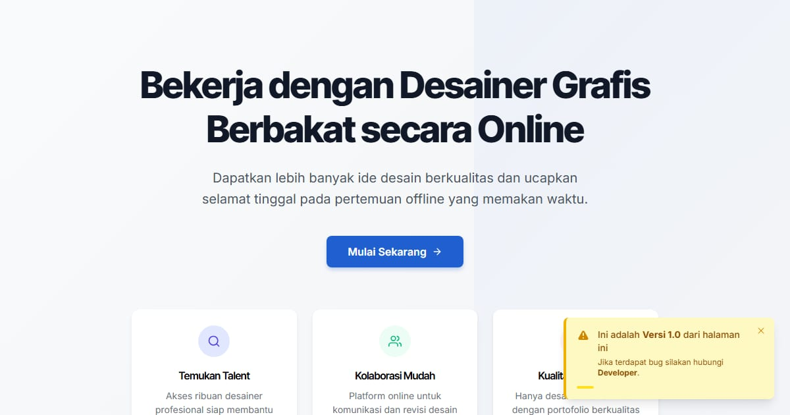

# Bribu — Papan Brief Desain, Tiga Sketsa yang Dibayar

Bribu: pasang brief desain, kurator memilih tiga desainer, dan ketiganya dibayar untuk satu sketsa. Anda memilih satu arah untuk diselesaikan — logo, kemasan, media sosial, ilustrasi.

**Demo live:** https://landing-bribu.vercel.app



> Template landing page untuk bisnis fiktif. Formulir di dalamnya hanya demo dan tidak mengirim data.

## Konsep

Bahasa rupa **Papan Lowongan**. Platform ini menjual kepastian menemukan orang yang tepat, jadi rupanya meniru papan pengumuman kerja yang tenang dan tertata.

## Halaman

- `/` — beranda: cara kerja, contoh tiga arah sketsa, perbandingan dengan kontes, paket, formulir pasang brief dengan pratinjau kartu, FAQ
- `/papan` — papan brief dengan saringan kategori & status
- `/papan/[kode]` — detail brief: kebutuhan, rasa, yang dihindari, tahap, tiga slot desainer & sketsa SVG
- `/untuk-desainer` — aturan, tabel uang sketsa & bagi hasil (dihitung dari data), formulir portofolio

## Teknologi

- Next.js 15.5 (App Router) dan React 19
- Tailwind CSS v4
- JavaScript
- Sketsa logo/kemasan/templat digambar dengan SVG dari data (tanpa gambar pihak lain)
- Font: Inter Tight, Inter (next/font)
- SEO: metadata per halaman, Open Graph, JSON-LD, sitemap.xml, dan robots.txt

## Menjalankan secara lokal

```bash
npm install
npm run dev
```

Buka http://localhost:3000. Untuk build produksi: `npm run build` lalu `npm start`.

---

Bagian dari koleksi 17 template landing page di [PortalLanding](https://portal-landing-seven.vercel.app). Dibuat oleh [PintuWeb](https://pintuweb.com), jasa pembuatan website.
